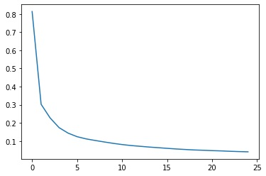
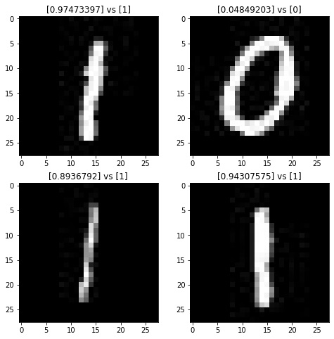

# Neural-Network-implementation-from-scratch

##  implementation of ANN and CNN only use `numpy`

*   ##  [layers](./layers/)
    *   ### [Fully Connected](./layers/FullyConnected.py)
    *   ### [Conv](./layers/Convolution.py)
    *   ### [Max Poll](./layers/MaxPoolling.py)

*   ##  [losses](./losses/)
    *   ### [Binary Cross Entropy](./losses/BinaryCrossEntropy.py)
    *   ### [Mean Squared Error](./losses/MeanSquaredError.py)

*   ##  [activation functions](./activations/)
    *   ### [sigmoid](./activations/sigmoid.py)
    *   ### [relu](./activations/sigmoid.py)

*   ##  [test FC](./main.py)
    *   ### 
    *   ### 

*   ##  [conv test](./conv_main.py)
    *   ### 
    *   ### 
